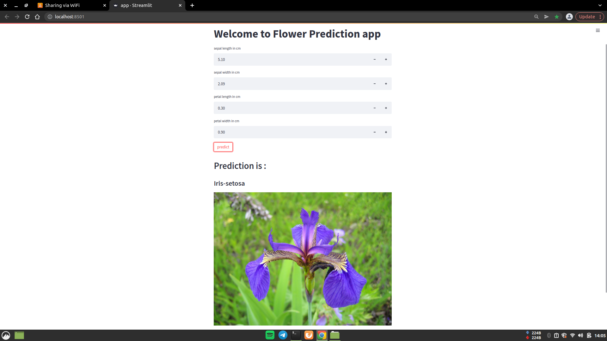

# streamlit_model_deploy
Model Deployment using streamlit

 
<h2>Quick Look</h2>

<h2>How to Run</h2>
1 - Download the Repository 
2 - Run coomand "streamlit run app.py" 
And the browser will open running this app 

<h1>Connect with me</h1>
If you have any queries regarding any of the topic I discussed in this video feel free to talk to e using below links: 
facebook : https://m.facebook.com/proogramminghub 
instagram : @programming_hut 
twitter : https://twitter.com/programming_hut 
github : https://github.com/Pawandeep-prog 
discord : https://discord.gg/G5Cunyg 
linkedin : https://www.linkedin.com/in/programminghut 
youtube : https://www.youtube.com/c/programminghutofficial 
